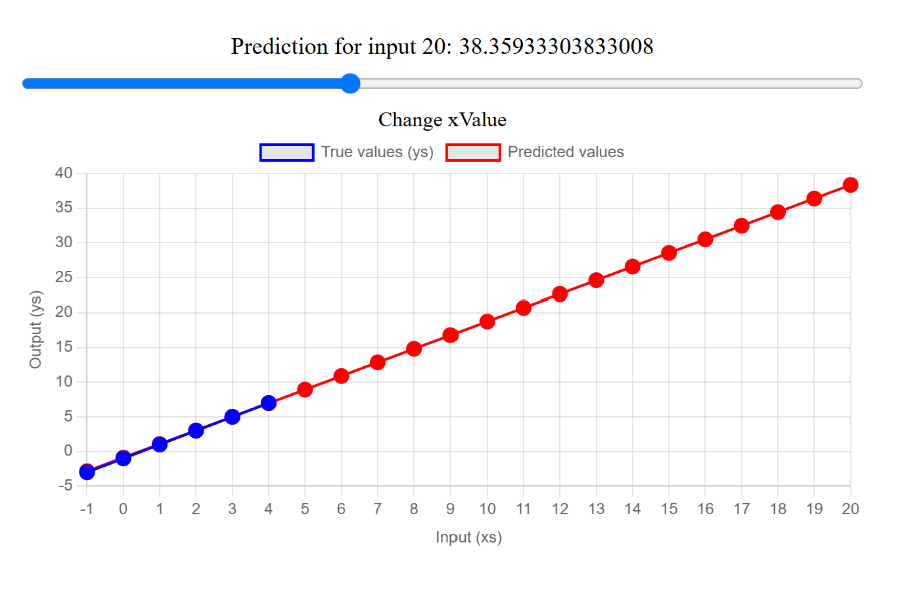

# Interactive Neural Network Linear Model Visualizer

An interactive web app that visualizes a simple neural network model built with TensorFlow.js. The model learns a linear relationship between input and output values, and the app allows real-time interaction with predictions shown on a dynamic chart.

## Features
- **Interactive Model**: Adjust the input value using a slider and see how the model's prediction changes.
- **Real-time Visualization**: The app uses Chart.js to visualize both the true values and the model's predictions on an interactive line graph.
- **TensorFlow.js**: The model is built using TensorFlow.js, providing a simple neural network to learn a linear relationship.

## Technologies Used
- **TensorFlow.js**: For building and training the neural network model.
- **Chart.js**: For visualizing the predictions and true values on a graph.
- **HTML, CSS, JavaScript**: For the front-end structure and interactivity.

## How to Run
1. Clone this repository to your local machine:
    ```bash
    git clone https://github.com/yourusername/your-repo-name.git
    ```
2. Open the `index.html` file in your web browser to view the interactive model.
3. Use the slider to change the input value and observe how the model's prediction updates on the chart.

## Example Screenshot



## Contributing
Feel free to fork the repository and submit a pull request if you'd like to contribute. Issues and suggestions are welcome!
